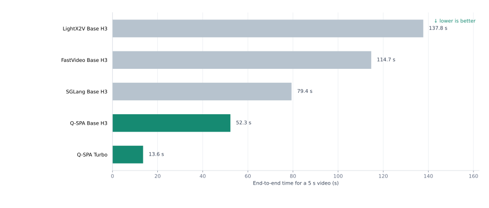

<!--
LOCALIZED-SOURCE
id: 00-introduction
language: zh-CN
-->

# Q-SPA：面向世界模型的量化、稀疏与并行 attention

作者：Heyang Sun · <a href="mailto:hsunbi@connect.ust.hk">hsunbi@connect.ust.hk</a>

[Q-SPA](#q-spa-system) 是一套面向计算密集型 world-model DiT 的量化、稀疏与并行 attention 设计。本文以 MiniMax-H3 为例，介绍如何把低精度计算、动态稀疏、质量控制和多卡执行组织成一条完整的推理路径。

  <strong>4 × H100：13.57 秒生成 5 秒、1344 × 768、124 帧视频和同步立体声音频</strong>
  Q-SPA 比 LightX2V 快 2.64 倍，比 SGLang 快 1.52 倍。

本文以 MiniMax-H3 为主要测试模型。它的 DiT 联合生成高分辨率视频和音频，计算同时集中在大规模 Linear/MLP 和长序列 attention。性能优化必须和运动稳定性、画面细节及音频完整性一起验证。

Q-SPA 包含三个相互关联的执行维度：

- 面向 Linear 与 attention 的 FP8 低精度计算；
- 基于 Sol-Attn 的动态 block 稀疏，以及质量敏感区域的稠密计算；
- Ulysses SP、Tensor Parallel 与通信计算重叠。

## Insights

- 量化与稀疏可以同时使用。稀疏 attention kernel 直接消费 FP8 表示时，两项
  优化能够共同贡献加速收益。
- 通用量化方案在 world model 的 DiT 上容易出现质量波动。attention 布局、
  激活范围和硬件相关 kernel 需要有针对性的重构，而不是套用通用量化封装。
- World-model 请求不仅包含长序列 DiT 去噪，还要完成条件理解与推理、视频和音频联合生成及解码。模型即使能够放入单卡，整条生成链路仍面临很高的计算压力；序列并行、张量并行与通信计算重叠可以把多卡算力转化为端到端延迟收益。
